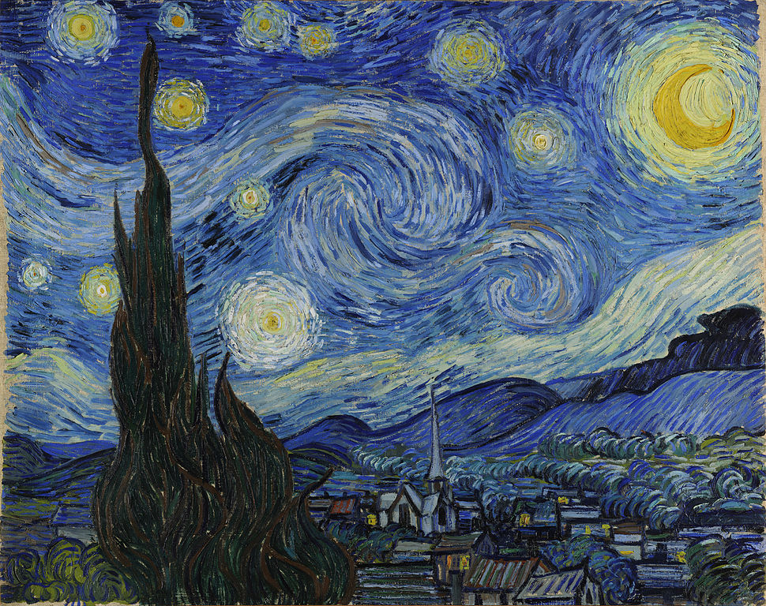
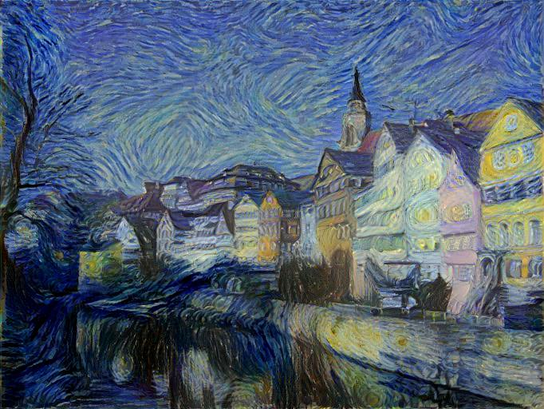

# A PyTorch Implementation of Image Style Transfer Using Convolutional Neural Networks

This is a PyTorch implementation of [Image Style Transfer Using Convolutional Neural Networks](http://www.cv-foundation.org/openaccess/content_cvpr_2016/html/Gatys_Image_Style_Transfer_CVPR_2016_paper.html), inspired by [authors of paper repo](https://github.com/leongatys/PytorchNeuralStyleTransfer).

### Usage
Simply run `python3 main.py`. 

You may want to change `DATA.STYLE_IMG_PATH`, `DATA.CONTENT_IMG_PATH` in config file, for transferring 
style of your desired style image to your content image.

### Example

We used the same images, as the authors.

Content Image:

Style Image:

Result of transferring the style to content image.

